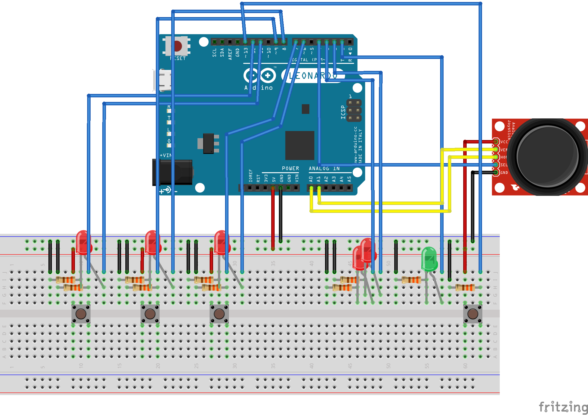
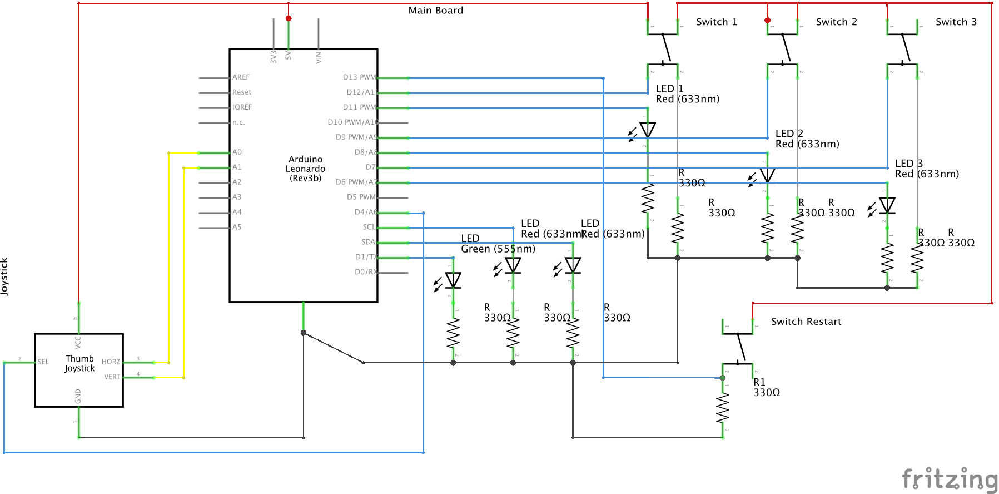

# Arduino 1010!

An implementation of the popular game "1010!" in JavaScript (fully ECMAScript 2015) controlled by Arduino.

## How does it work?

It's really simple. Arduino and Server are connected via [Web Sckets](http://socket.io/).
Any interaction of a user with the device is forwarded to the Server via a socket. Server after receiving the socket processes the request and make something in the game.

When the user is able to do something in the game, green LED will be blinking. In the other case two, red LEDs will be blink alternately.

## How can I run it?

**Requirements**

* [Arduino Leonardo](https://www.arduino.cc/en/Main/ArduinoBoardLeonardo),
* [NodeJS](https://nodejs.org/en/) (_tested on 6.1_),
* [Google Chrome](https://www.google.pl/chrome/browser/desktop/) (_higher than 47.0_),
* [Arduino IDE](https://www.arduino.cc/en/Main/Software) _(needs for load **Arduino StandardFirmata**)_,
* Basic knowledge about [Command Line Interface](https://en.wikipedia.org/wiki/Command-line_interface).

Follow step by step an instruction below:

### Build a Game Controller

1. Prepare:
 - 6x [LEDs](https://www.google.pl/search?q=LED), 
 - 10x [resistors](https://www.google.pl/search?q=resistor+330+ohm) 330 Ω,  
 - 4x buttons (prefered ["Tactical Switch"](https://www.google.pl/search?q=Tactical+Switch)), 
 - [Thumb Joystick](https://www.google.pl/search?q=thumb+joystick)
2. Check out the [**Circuit diagram**](#circuit-diagram)
3. Based on [**Breadboard preview**](#breadboard-preview) - build *Game Controller*

### Prepare an Arduino

Please follow [an instruction](https://github.com/rwaldron/johnny-five/wiki/Getting-Started#trouble-shooting).

### Prepare a project

1. Clone this repository (`git clone git@github.com:pomek/Arduino1010.git`),
2. Install dependencies (`npm install`),
3. Connect the Arduino with a computer,
4. Run the game (`npm run gulp`).

#### A breadboard preview

#### A circuit diagram

## Terms of the game

Based on the breadboard above:

* Buttons (from left to right) mean which shape will be active (after pressed),
* A LED above a button means which shape is active now,
* If you press the same button two times - shape will be indeterminate,
* After paste a shape, a LED will switch off,
* If game is over - two LEDs will be blink alternately, otherwise - a green LED will be blinking,
* After choose a shape - you can choose a place to paste (use the joystick)
* If you want to paste the shape - press down the joystick,
* If you want to restart game - press button at right side.

## To do

I'm open for any improvements of the game. If you have any idea, but you don't want or you cannot do this, please leave me an issue.

My road map contains following points:

- [ ] Add display [LCD HD44780](https://www.google.pl/search?q=LCD+HD44780),
- [ ] Easy way to add custom shapes,
- [ ] Try to optimize used pins,
- [ ] In the future: build a device (the computer won't be needed).

## Development

If you want to do anything with the game, please follow the terms below:

* Each change breadboard or circuit diagram should be updated (use [Fritzing](http://fritzing.org/home/)),
* Each change of code should be tested (unit tests),
* Each change should be written down in [Changelog](changelog.md),
* Build status on [Circle](https://circleci.com/gh/pomek/Arduino1010) should be *success*.

### Gulp tasks

For development you can use [Gulp](http://gulpjs.com/) tasks below:

* `clean` - removes directory with temp. files,
* `clean:test` - removes directory with *compiled* tests,
* `sass` - builds stylesheets,
* `sass:watch` - builds stylesheets and waiting for changes,
* `scripts` - builds scripts,
* `scripts:watch` - builds scripts and waiting for changes,
* `scripts:test` - builds unit tests,
* `inject` - adds styles and scripts into view file,
* `inject:watch` - the same as `inject`, but waits for changes,
* `arduino` - runs Arduino script,
* `server` - runs web server,
* `lint` - checks code styles,
* `test` - runs unit tests,
* `units` - runs sequence of tasks: `scripts:test`, `clean:test`, `test`,
* `default` - runs sequence of tasks: `clean`, `sass`, `scripts`, `inject`, `server`.
